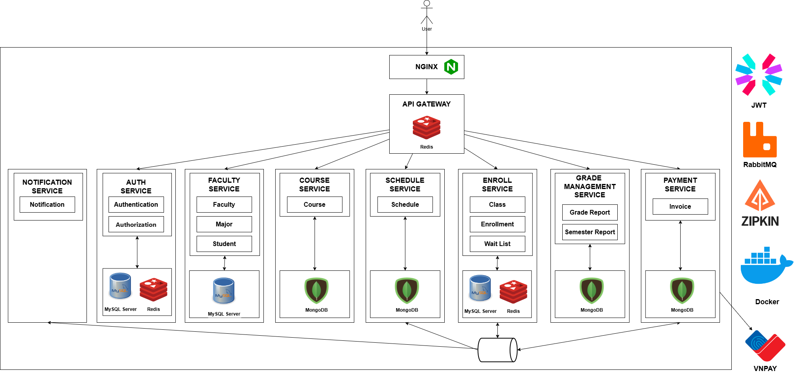
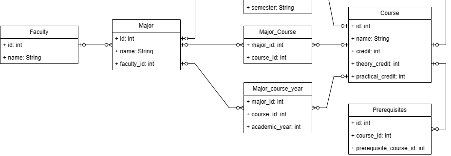

## Sơ đồ hệ thống

### Sơ đồ user

#### Có 2 loại user Admin và Student

### Sơ đồ môn học

#### Mỗi môn học sẽ có 1 hoặc nhiều môn học tiên quyết (prerequisites), từng môn học sẽ có 1 số lương tín chỉ lý thuyết (theory) và thực hành (practical) nhất định, và tổng số tín chỉ. Các môn học (Course) thuộc nhiều khoa, và một khoa (Department) có thể có nhiều môn học, quan hệ nhiều - nhiều (Department_Course)

### Sơ đồ đăng ký học phần

#### Mỗi sinh viên (Student) có thể đăng ký nhiều lớp học (Class) và một lớp học (Class) có thể được đăng ký bởi nhiều sinh viên (Student), Sau khi đăng ky (Enrollment), mỗi lớp học phần sinh viên sẽ có các trường điểm lý thuyết (theory) và thực hành (practical) khác nhau, nếu số tín chỉ thực hành (practical_credit) là 0 thì các cột điểm practical_score_period sẽ là null, và ngược lại

