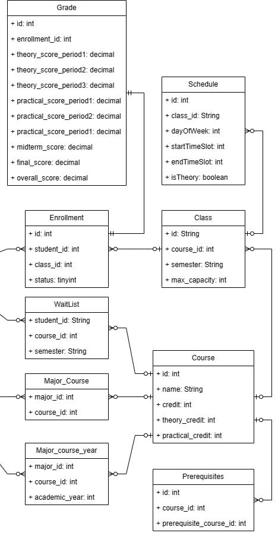

## Sơ đồ hệ thống

### Sơ đồ user

#### User có 2 role, Chưa tốt nghiệp và đã tốt nghie,65

### Sơ đồ môn học

#### Mỗi môn học sẽ có 1 hoặc nhiều môn học tiên quyết (prerequisites), từng môn học sẽ có 1 số lương tín chỉ lý thuyết (theory) và thực hành (practical) nhất định, và tổng số tín chỉ. Các môn học (Course) thuộc nhiều chuyên ngành(Major), và một chuyên ngành(Major) có thể có nhiều môn học, quan hệ nhiều - nhiều (Major_Course). Mỗi năm các môn học trong từng chuyên ngành (Major_course_year) sẽ có thể có sự thay đổi

### Sơ đồ đăng ký học phần

#### Mỗi sinh viên (Student) có thể đăng ký nhiều lớp học (Class) và một lớp học (Class) có thể được đăng ký bởi nhiều sinh viên (Student), Sau khi đăng ky (Enrollment), mỗi lớp học phần sinh viên sẽ có các trường điểm lý thuyết (theory) và thực hành (practical) khác nhau, nếu số tín chỉ thực hành (practical_credit) là 0 thì các cột điểm practical_score_period sẽ là null, và ngược lại. Trong trường hợp lớp đầy (max_capacity), và khi đăng ký phải kiểm tra môn học tiên quyết đã thỏa hay chưa

